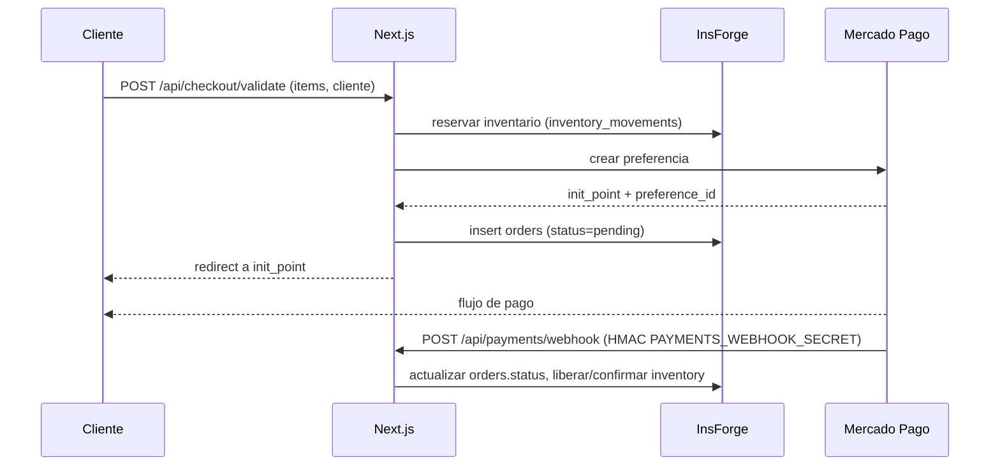
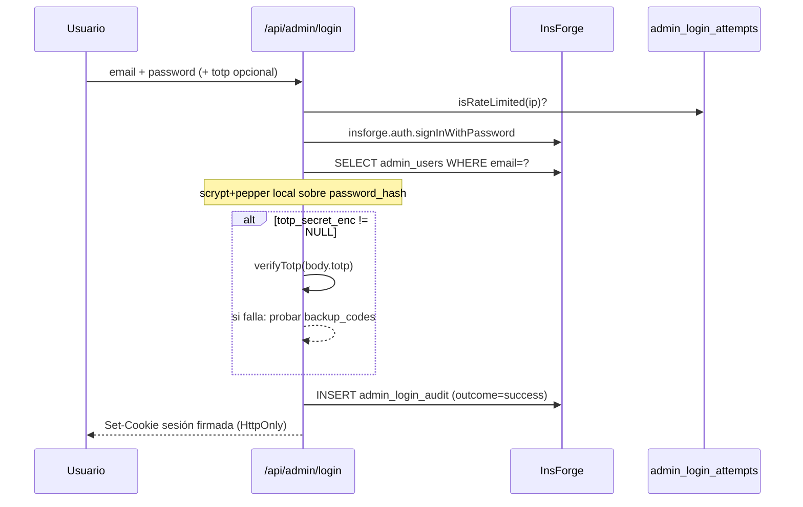
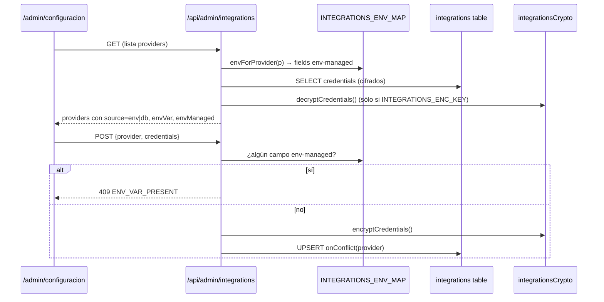

# Arquitectura

> Última actualización: **2026-05-09** · Rama auditada: `copilot/assess-app-value-and-market-price`.

Este documento describe la arquitectura **real** del repositorio (lo que existe en `src/`, no lo que se planea). Si añades un componente que cambia un flujo de los descritos abajo, actualiza este archivo y `docs/inventory.md` en el mismo PR.

---

## 1. Stack

- **Framework**: Next.js 15 (App Router, RSC) con React 19.
- **Runtime**: Node 20.x / 22.x en Vercel (edge no usado por defecto; las API son serverless functions Node).
- **Lenguaje**: TypeScript estricto (`tsc --noEmit` corre en CI).
- **Backend de datos**: [InsForge](https://insforge.dev) (PostgreSQL gestionado + auth + storage detrás de PostgREST). `src/lib/insforge.ts` instancia `InsForgeClient` vía `@insforge/sdk` con URL/anon-key con fallback hardcoded.
- **Pagos**: Mercado Pago (`src/lib/mercadopago.ts`).
- **Email transaccional**: Resend (helpers todavía en plan, no fusionados — ver `docs/inventory.md §3`).
- **Email/landing pública**: Sentry para error tracking (`@sentry/nextjs`), Vercel Analytics.
- **Observabilidad runtime**: `admin_error_logs` (DB) + Sentry + `/api/admin/vercel/logs` (proxy a Vercel REST).
- **3D / animaciones**: `three` + `@react-three/fiber` + `@react-three/drei` + `framer-motion` + `gsap` + `animejs`.

---

## 2. Diagrama de alto nivel

```mermaid
flowchart LR
    subgraph Client[Cliente]
        BR[Browser / PWA]
        SW[Service Worker]
    end

    subgraph Vercel[Vercel - Next.js 15]
        PUB[Páginas públicas RSC<br/>/, /tienda, /soluciones, /producto, …]
        ADM[/admin<br/>RSC + client islands/]
        APIPUB[/api/* públicas<br/>checkout, leads, push, sync, …/]
        APIADM[/api/admin/*<br/>integrations, login, blog, productos, …/]
        CRON[/api/cron/refresh-rates/<br/>Vercel Cron]
    end

    subgraph InsForge[InsForge - BaaS]
        PG[(Postgres)]
        AUTH[Auth API]
        ST[Storage / buckets]
    end

    subgraph Ext[Servicios externos]
        MP[Mercado Pago]
        CL[Cloudinary]
        VER[Vercel REST API]
        SEN[Sentry]
        TUR[Cloudflare Turnstile]
        WPP[WhatsApp]
    end

    BR --> PUB
    BR --> ADM
    BR --> APIPUB
    SW -.notif/cache.-> BR

    PUB -- SDK --> AUTH
    PUB -- SDK / PostgREST --> PG
    ADM -- session cookie --> APIADM

    APIADM --> PG
    APIADM --> ST
    APIADM --> CL
    APIADM --> VER
    APIPUB --> PG
    APIPUB --> MP
    APIPUB --> ST
    APIPUB --> TUR
    APIPUB --> WPP

    CRON --> PG
    Client -.errores.-> SEN
    APIPUB -.errores.-> SEN
    APIADM -.errores.-> SEN
```

---

## 3. Capas

### 3.1. Frontend público (`src/app/*` sin `/admin` ni `/api`)

- 24 páginas (`page.tsx` bajo `src/app/` excluyendo `/admin`) — landing, tienda, producto, checkout, soluciones, servicios, blog, casos, cotizaciones, presupuesto, mi-cuenta, favoritos, seguimiento, contacto, garantías, evolución, juego, ajustes, offline, auth.
- PWA: `app/manifest.ts`, `sitemap.ts`, `robots.ts`, service worker registrado en cliente.
- Carrito en `localStorage` con `zustand` (no se persiste en backend hasta el checkout).

### 3.2. Panel de admin (`src/app/admin/*`)

- 30 módulos — ver lista en `docs/inventory.md §2`.
- Sesión vía cookie firmada (`src/lib/adminAuth.ts`) — independiente del JWT de InsForge para no exponer la API del cliente al admin.
- Hardening: TOTP 2FA + backup codes + rate-limit persistente + audit log + verificación scrypt local del password (memorias vivas: `totp 2fa`, `backup codes`, `rate limit persistent`, `login audit`, `owner password hash`).

### 3.3. API serverless (`src/app/api/*`)

- 85 `route.ts` — 40 admin, 44 públicos, 1 cron.
- Inventario completo en `docs/api.md`.
- Patrón: cada `route.ts` exporta `GET`/`POST`/… async; valida sesión (admin → cookie firmada; público → JWT InsForge en `Authorization: Bearer`); usa `insforge`/`insforgeAdmin` o llamadas directas a PostgREST.

### 3.4. Datos (InsForge / Postgres)

- 36 tablas agrupadas en dominios (commerce, auth-admin, content, integrations, observability) — ver `docs/data-model.md`.
- DDL en `scripts/create-tables.sql` (1016 líneas; aplicable desde `/admin/sql`).
- **Sin RLS de Supabase**: InsForge no soporta `auth.jwt()` ni `ENABLE ROW LEVEL SECURITY`; el filtrado de acceso ocurre en la API key + cookies de sesión (memoria viva: `insforge sql limits`).

---

## 4. Flujos críticos

### 4.1. Checkout



Helpers: `src/lib/checkout.ts`, `src/lib/inventory.ts`, `src/lib/mercadopago.ts`.

### 4.2. Login admin (con TOTP)



Helpers: `adminAuth`, `adminPasswordHash`, `adminTotp`, `adminTotpCrypto`, `adminBackupCodes`, `adminRateLimitStore`, `adminLoginAudit`.

### 4.3. Centro de integraciones



Detalles en memorias `integrations env map`, `integrations encryption`, `env-managed credentials`.

---

## 5. Workflows CI/CD

| Workflow                | Trigger                             | Responsabilidad                                                                 |
|-------------------------|-------------------------------------|---------------------------------------------------------------------------------|
| `.github/workflows/ci.yml`        | push/PR a `main`                    | Pipeline unificado Fase 3: install → lint → typecheck → test:coverage → build, matriz Node 20.x/22.x. Sube `coverage/` (Node 20.x) como artifact.|
| `.github/workflows/e2e.yml`       | `deployment_status === success`     | Playwright (`tests/e2e/*`) contra preview de Vercel.                            |
| `.github/workflows/vercel.yml`    | manual / push                       | Deploy a Vercel.                                                                |
| `.github/workflows/docker-image.yml` | push de tag                       | Build de imagen Docker (no es el path principal de deploy).                     |

---

## 6. Convenciones internas (resumen)

- **Errores en API**: respuestas JSON con `{ error, code }`; nunca `throw` sin captura — el handler central registra a Sentry y a `admin_error_logs`.
- **Credenciales de proveedores**: env vars > DB cifrada (`integrations.credentials`). Toda lectura va por un helper `get*Credentials()` en `src/lib/`. Añadir un alias env nuevo requiere tocar `integrationsEnvMap.ts` **y** el helper consumidor (memoria viva: `env-managed credentials`).
- **Cron**: solo Vercel Hobby permite 1×/día; cualquier expresión sub-diaria rompe el deploy (memoria viva: `vercel cron limits`).
- **SQL en `/admin/sql`**: sin sintaxis Supabase (`auth.jwt()`, RLS); solo `CREATE TABLE IF NOT EXISTS` + índices (memoria viva: `insforge sql limits`).
- **Tests**: `vitest run` (29 archivos hoy), umbrales de cobertura como gate del PR — `lines: 18, statements: 18, functions: 40, branches: 70` calibrados al baseline 2026-05-09; ratchet anti-regresión.

---

## 7. Cosas que **no** son parte de la arquitectura aún

Lo siguiente está en planos pero no en `main` (auditado en `docs/inventory.md §3`):

- UI `/admin/integraciones`, OAuth de Mercado Libre/Google/Meta/TikTok, presupuestos auto-destructibles, healthcheck cron diario, módulo de inteligencia de mercado, Resend integrado, fachada DB (anti-lock-in InsForge), multi-tenant.

Si vas a fusionar uno de esos módulos, **antes** corre `git fetch --all --prune` desde una sesión con red completa para verificar si existe en una rama remota viva (memorias internas describen los patrones, pero los archivos pueden no estar).
