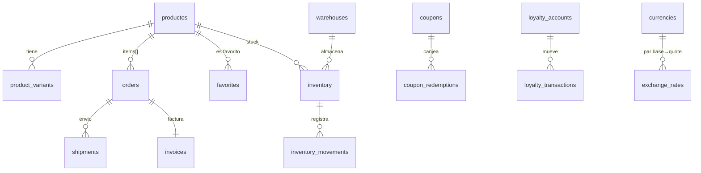

# Modelo de datos

> Última actualización: **2026-05-09** · Fuente: `scripts/create-tables.sql` (1016 líneas).

InsForge expone Postgres detrás de PostgREST + auth. **No hay RLS** (el endpoint SQL de InsForge rechaza `auth.jwt()` y `ALTER TABLE … ENABLE ROW LEVEL SECURITY`); la autorización ocurre en la API key + en las cookies de sesión del admin (ver `docs/architecture.md §4`).

Las 36 tablas vivas se agrupan en cinco dominios.

---

## 1. Auth & seguridad del admin

| Tabla                   | Propósito                                                                  | Helper / API consumidor |
|-------------------------|----------------------------------------------------------------------------|-------------------------|
| `admin_users`           | Operadores con `password_hash` (scrypt+pepper), `totp_secret_enc`, `backup_codes[]`, `totp_enabled_at`, `backup_codes_generated_at`. | `adminAuth`, `adminPasswordHash`, `adminTotp*`, `adminBackupCodes` |
| `admin_login_attempts`  | PK `ip`, columnas `count`, `blocked_until`, `updated_at`. Rate-limit persistente con caché en memoria. | `adminRateLimitStore` |
| `admin_login_audit`     | Audit log fire-and-forget: `id`, `ts`, `ip`, `email`, `outcome` (enum cerrado), `reason`, `user_agent`. | `adminLoginAudit` |
| `admin_error_logs`      | Errores backend agregados (path, status, message, stack, ts).              | `/api/admin/error-logs/*` |

**Ver memorias vivas**: `owner password hash`, `totp 2fa`, `backup codes`, `rate limit persistent`, `login audit`.

---

## 2. Commerce (catálogo + venta)

| Tabla                | Propósito                                                                                       |
|----------------------|-------------------------------------------------------------------------------------------------|
| `productos`          | Catálogo principal en español. Campos SEO `meta_title`, `meta_description`, `seo_keywords text[]`, `jsonld jsonb` (memoria `seo suggestions`). |
| `products`           | Tabla legacy en inglés (productos genéricos previos al rediseño). Coexiste con `productos`.     |
| `product_variants`   | Variantes por SKU/talla/color, FK a `productos`.                                                |
| `inventory`          | Stock por (`producto_id`, `warehouse_id`).                                                      |
| `inventory_movements`| Audit de altas/bajas/reservas; sustenta `/api/inventory/{reserve,release}`.                     |
| `warehouses`         | Bodegas físicas (origen de envíos).                                                             |
| `orders`             | Órdenes con totales, `status` (pending/paid/shipped/cancelled), `cliente jsonb`, `items jsonb`. |
| `quotes`             | Cotizaciones con `slug` único, `items jsonb`, `expira_at`. Públicas vía `/api/quotes`.          |
| `coupons` / `cupones` | Catálogo de cupones (dos tablas, una en inglés y otra en español — convergencia pendiente).    |
| `coupon_redemptions` | Registro de canjes; `/api/coupons/validate` la consulta.                                         |
| `loyalty_accounts`   | Cuenta de fidelización por usuario (`user_id`, `balance`, `tier`).                              |
| `loyalty_transactions` | Movimientos de puntos (earn/redeem/adjust).                                                    |
| `referrals`          | Códigos de referido y atribución.                                                               |
| `favorites`          | Wishlist por usuario; `/api/favorites/*`.                                                       |
| `shipments`          | Envíos creados (carrier, tracking_code, status). Helpers: `src/lib/shipping/`.                  |
| `shipping_addresses` | Direcciones reutilizables por usuario.                                                          |
| `invoices`           | Facturas con FK a `orders`; `/api/invoices/[id]/pdf`.                                           |
| `currencies`         | Catálogo ISO 4217 (CLP, USD, …).                                                                |
| `exchange_rates`     | Snapshots diarios por par; lo refresca `/api/cron/refresh-rates`.                               |

---

## 3. Contenido editorial / CMS

| Tabla            | Propósito                                                                                |
|------------------|------------------------------------------------------------------------------------------|
| `blog_posts`     | Posts (slug, title, excerpt, body MDX, cover, published_at).                             |
| `posts`          | Tabla legacy paralela a `blog_posts`.                                                    |
| `media_assets`   | Assets en Cloudinary/InsForge bucket (URL, alt, owner).                                  |
| `home_sections`  | Secciones del home reordenables (`order_index`, `kind`, `payload jsonb`).                |
| `banners`        | Banners promocionales con `start_at`/`end_at`.                                           |
| `materials`      | Catálogo de materiales (acero, madera, etc.) por proyecto.                               |
| `projects`       | Proyectos terminados (showroom público en `/proyectos`).                                 |
| `site_structure` | KV genérico (`key` PK, `value jsonb`) para textos editables del sitio (`/api/site-structure/[key]`). |
| `configuracion`  | Pares clave-valor de configuración global del admin.                                     |

---

## 4. Integraciones

| Tabla            | Propósito                                                                                |
|------------------|------------------------------------------------------------------------------------------|
| `integrations`   | UPSERT por `provider` (PK lógica `provider`), columna `credentials jsonb` cifrada con AES-256-GCM cuando `INTEGRATIONS_ENC_KEY` está seteada (memoria `integrations encryption`). Campos por valor: `enc:v1:iv:tag:ct`. |
| `leads`          | Captura de leads del agente IA (`/api/leads`) y formularios públicos.                    |

---

## 5. Observability & PWA

| Tabla            | Propósito                                                                                |
|------------------|------------------------------------------------------------------------------------------|
| `pwa_events`     | Telemetría PWA (instalación, push subscription, offline) — `/api/pwa/track`.             |

---

## 6. Tablas que **planean** existir pero no están en `main`

Estas existen en el plan maestro (memorias vivas, `docs/inventory.md §3`) pero **no** en `scripts/create-tables.sql`:

- `presupuestos` (slug único, `items jsonb`, `expira_at default now()+5d`)
- `integration_audit`, `integration_health_log`, `integration_quota_snapshots`
- `market_intel_snapshots`, `market_intel_refs`, `market_intel_trends`, `seo_suggestions`
- `product_import_history` (caché 24h por URL normalizada)
- `tenants` (multi-tenant)

---

## 7. Diagrama ER simplificado (commerce)

---

## 8. Convenciones

- **Timestamps**: `timestamptz` con default `now()`. Ningún campo `timestamp` sin TZ.
- **Identificadores**: `uuid` con `gen_random_uuid()` para entidades nuevas; `bigint identity` para tablas legacy (`products`, `posts`).
- **JSON**: `jsonb` (no `json`) para todos los campos que aceptan estructura — payloads, items de orden, configuración.
- **Texto largo**: `text` (no `varchar(n)` salvo justificación). Truncados en aplicación, no en DDL.
- **Índices**: `CREATE INDEX IF NOT EXISTS` solo donde el endpoint hace lookup por columna no-PK.
- **Migraciones**: NO hay tool de migración formal (Prisma/Knex/etc.). El DDL vive todo en `scripts/create-tables.sql` y se aplica desde `/admin/sql`. Cualquier cambio de schema debe **(a)** añadirse al SQL idempotente del script y **(b)** tolerar tabla pre-existente con columnas faltantes (vía `ALTER TABLE … ADD COLUMN IF NOT EXISTS`).
